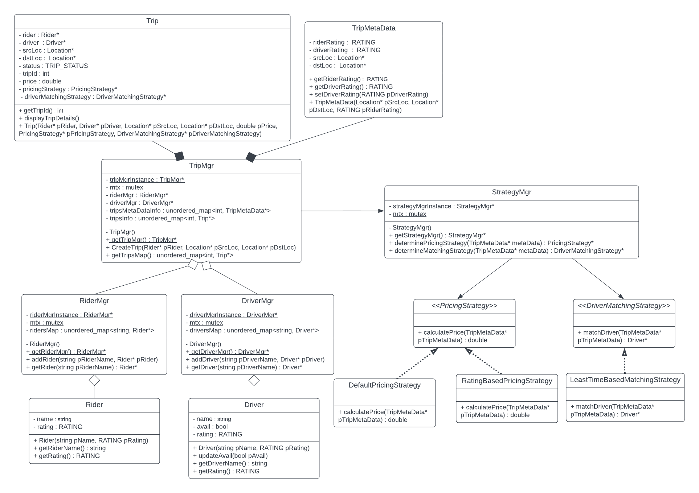

## LLD Diagram : Keerti Purswani

### Video : https://www.youtube.com/watch?v=a-F45Jov0Ck

## HLD (Scaler) : https://www.youtube.com/watch?v=ZotHUoS-RCE

# Functional Requirements

## Driver

1. Create Profile
2. Show Availibility
3. Accept/Reject Ride
4. Navigate to Pickup
5. Start Ride
6. Navigate to Drop
7. End Ride
8. Payment

## Rider

1. Create Profile
2. show cabs nearby
3. Add start/End Location
4. Show Estimation of time and price
5. Book Cab
6. Make Payment
7. Rate the driver

---> See past trips
---> See current trip

# Non Functional Requirements

1. Minimum Latency
2. High Available
3. Durable
4. Durable
5. Highly Scalable
6. Strong Consistency